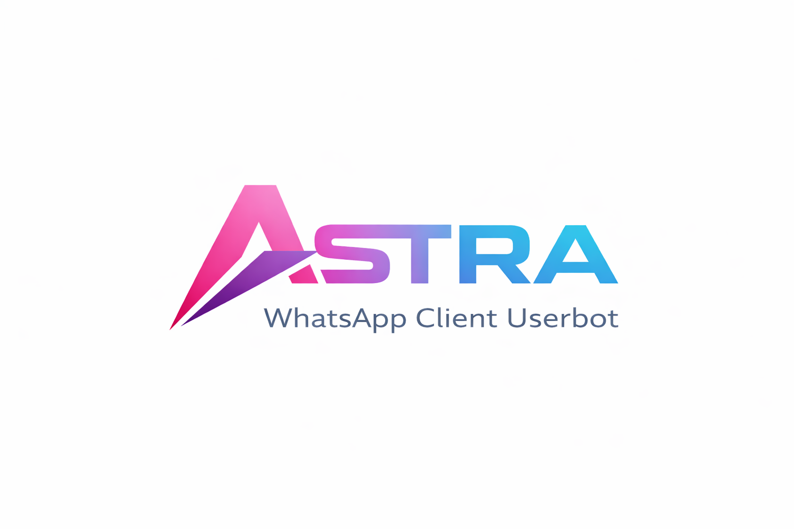

# Astra Userbot (dev-beta)

A high-performance, extensible, and production-ready **WhatsApp Userbot
Framework** built on top of the **Astra Engine**. Designed for
developers who need power, modularity, and efficiency.

------------------------------------------------------------------------
<p align="center">
  
</p>


------------------------------------------------------------------------

## ⚡ One-Click Deployment

Deploy Astra Userbot instantly on your preferred platform:

[](https://railway.app/new)
[](https://heroku.com/deploy?template=https://github.com/paman7647/Astra-Userbot)
[](https://render.com/deploy)

For Localhost, Docker, and VPS setups, refer to the **Deployment Guide (DEPLOYMENT.md)**.

------------------------------------------------------------------------

## 🧠 Astra Core Library

Astra Userbot is powered by the Astra Engine Core, which handles:

-   Plugin loading
-   Event routing
-   System automation
-   Lifecycle management

Core Library Repository:\
[](https://github.com/paman7647/astra)

------------------------------------------------------------------------

## 🚀 Key Features

### 🔌 Modular Plugin Architecture

Extend or remove features using the `commands/` directory.

### 🤖 AI Integration

Powered by Google's Gemini 3 Flash Preview models.

### 🎬 Media Toolkit

Supports downloading from: - YouTube - Instagram - Other media
platforms\
via a JS-based media bridge.

### 🧩 Persistent State Storage

Stores: - AFK states - Sudo users - Permissions - Notes / custom tags

### 🛠 Developer-Friendly

-   Clean Python code
-   Automated environment setup
-   Clear module structure
-   Error-resilient engine

------------------------------------------------------------------------

## 🖥️ Local & VPS Installation

### Windows (PowerShell)

Run as Administrator:

``` powershell
iwr -useb https://raw.githubusercontent.com/paman7647/Astra-Userbot/main/install.ps1 | iex
```

### macOS / Linux / VPS

``` bash
bash <(curl -fsSL https://raw.githubusercontent.com/paman7647/Astra-Userbot/main/install.sh)
```

For Docker & cloud installations, consult **DEPLOYMENT.md**.

------------------------------------------------------------------------

## ⚙️ Configuration

1.  Copy the example environment file:

``` bash
cp .env.example .env
```

2.  Open `.env` and add:

  Variable              Description
  --------------------- ----------------------------
  `GEMINI_API_KEY`      Google AI API key
  `OWNER_WHATSAPP_ID`   Example: 910000000000@c.us

------------------------------------------------------------------------

## ▶️ Running the Bot

### Initial Authentication (QR Login)

``` bash
python3 bot.py
```

### Regular Operation

``` bash
python3 bot.py
```

------------------------------------------------------------------------

## 📚 Common Commands

  Command    Alias        Description
  ---------- ------------ --------------------------------
  `.alive`   ---          Shows system status & uptime
  `.ai`      `.chat`      Chat with Gemini AI
  `.yt`      `.youtube`   Download YouTube video/audio
  `.ig`      `.reel`      Download Instagram posts/reels
  `.ping`    ---          Check bot latency

------------------------------------------------------------------------

## 🧩 Project Structure

    Astra-Userbot/
    │── bot.py                 # Main launcher
    │── commands/              # Modular plugin commands
    │── utils/                 # Utility modules and configs.
    │── .env.example           # Example config
    └── install.sh / install.ps1

------------------------------------------------------------------------

## 📜 License

Licensed under the MIT License.\
See LICENSE for complete details.
